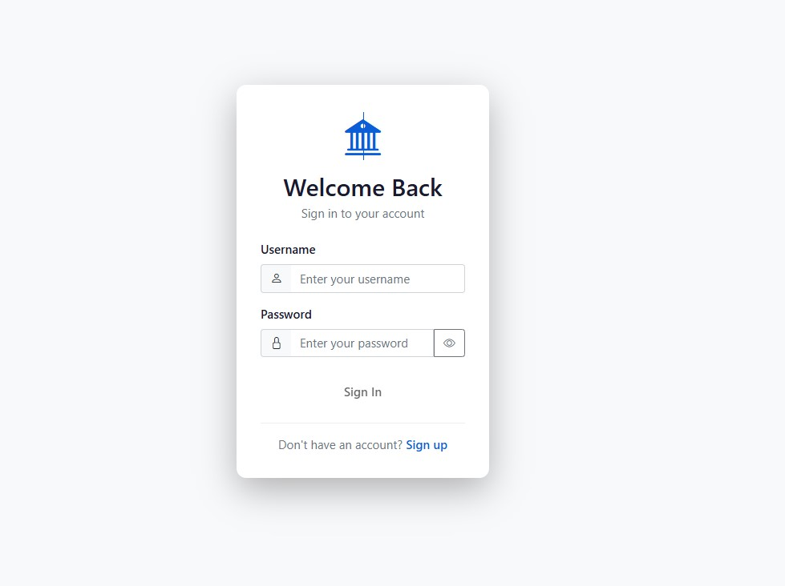
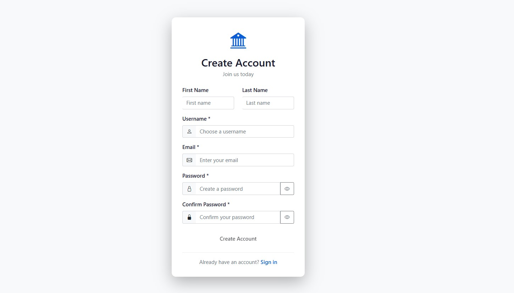
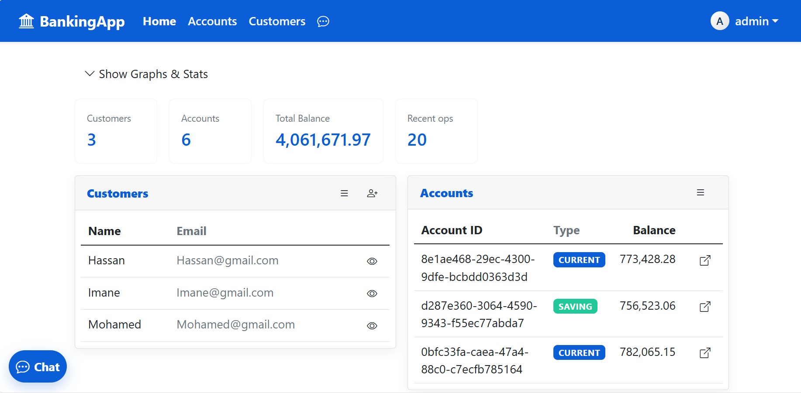
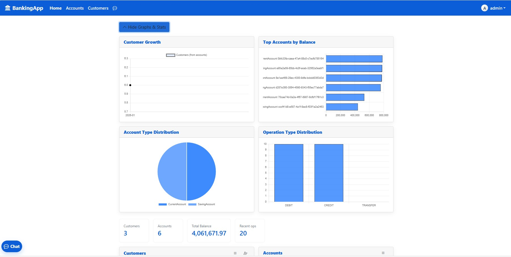
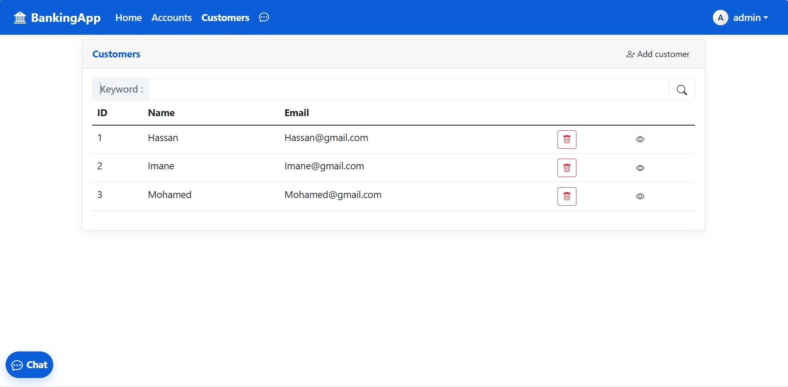
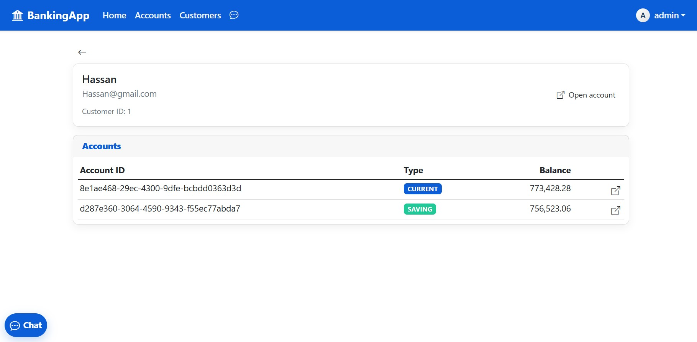
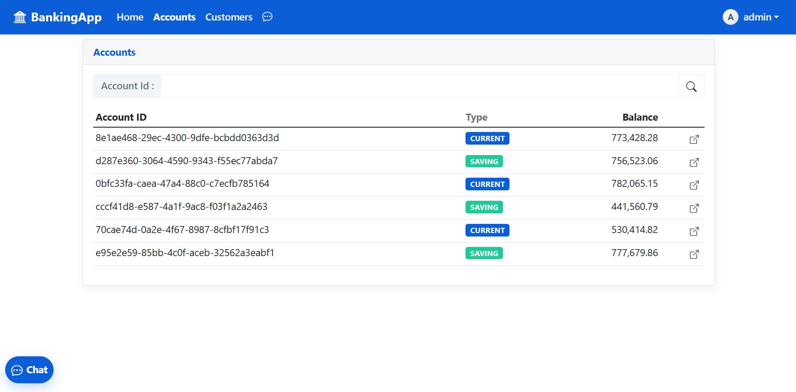
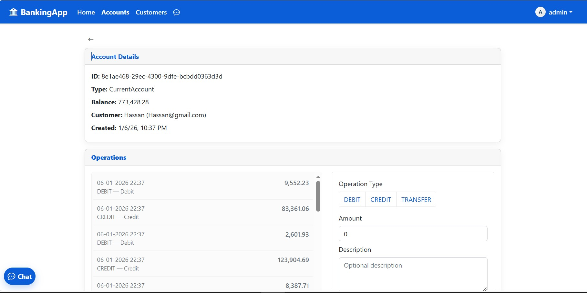
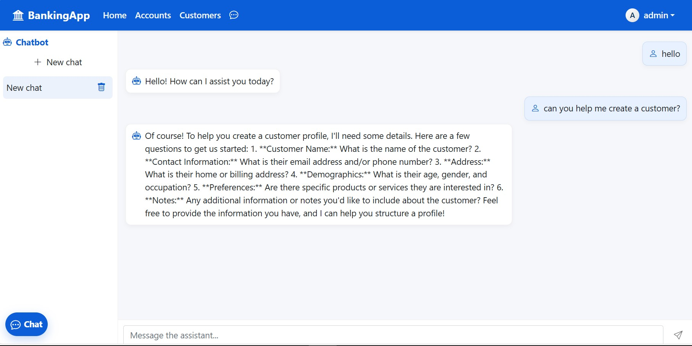

# Banking Application - JEE Final Exam Project

## 📋 Project Overview

A full-stack banking application that allows users to manage bank accounts, customers, and perform banking operations. The application features user authentication, role-based access control, and an AI-powered chatbot for customer assistance.

## 🏗️ Architecture

This is a **3-tier web application** with:
- **Frontend**: Angular 13 (Single Page Application)
- **Backend**: Spring Boot 3.3.5 (RESTful API)
- **Database**: H2 In-Memory Database
- **Security**: JWT-based authentication
- **AI Integration**: OpenAI GPT-4o-mini chatbot

## 🛠️ Technologies Used

### Frontend Technologies
| Technology | Version | Purpose |
|------------|---------|---------|
| **Angular** | 13.3.0 | Main frontend framework |
| **TypeScript** | 4.6.2 | Programming language |
| **Bootstrap** | 5.1.3 | UI framework for responsive design |
| **Bootstrap Icons** | 1.8.2 | Icon library |
| **RxJS** | 7.5.0 | Reactive programming (Observables) |
| **Chart.js** | 4.4.0 | Data visualization for account history |

### Backend Technologies
| Technology | Version | Purpose |
|------------|---------|---------|
| **Spring Boot** | 3.3.5 | Main backend framework |
| **Java** | 17 | Programming language |
| **Spring Data JPA** | - | Database ORM |
| **Spring Security** | - | Authentication & Authorization |
| **H2 Database** | - | In-memory database |
| **Lombok** | 1.18.34 | Reduces boilerplate code |
| **JWT (JJWT)** | 0.12.3 | JSON Web Token implementation |

### Additional Features
- **OpenAI Integration**: GPT-4o-mini for intelligent chatbot
- **RESTful API**: Communication between frontend and backend
- **JWT Authentication**: Secure token-based authentication
- **Role-Based Access Control**: ADMIN and USER roles

## 📁 Project Structure

```
banking_app_JEE_final_exam-main/
├── angular-banking-frontend/          # Frontend Application
│   ├── src/
│   │   ├── app/
│   │   │   ├── components/           # UI Components
│   │   │   │   ├── home/            # Dashboard
│   │   │   │   ├── login/           # Login page
│   │   │   │   ├── register/        # Registration page
│   │   │   │   ├── profile/         # User profile
│   │   │   │   ├── customers/       # Customer management
│   │   │   │   ├── accounts/        # Account listing
│   │   │   │   ├── account-detail/  # Account operations
│   │   │   │   ├── customer-accounts/ # Customer's accounts
│   │   │   │   ├── new-customer/    # Add customer
│   │   │   │   ├── chatbot/         # AI chatbot
│   │   │   │   └── navbar/          # Navigation bar
│   │   │   ├── services/            # API Services
│   │   │   │   ├── auth.service.ts
│   │   │   │   ├── customer.service.ts
│   │   │   │   ├── accounts.service.ts
│   │   │   │   └── chat.service.ts
│   │   │   ├── guards/              # Route Guards
│   │   │   │   ├── auth.guard.ts
│   │   │   │   └── auth.interceptor.ts
│   │   │   ├── model/               # TypeScript Models
│   │   │   └── shared/              # Shared utilities (pipes)
│   │   ├── assets/                  # Static assets
│   │   └── environments/            # Environment configs
│   └── package.json                 # Frontend dependencies
│
└── spring-banking-backend/           # Backend Application
    ├── src/main/java/ma/mundia/springbankingbackend/
    │   ├── entities/                # JPA Entities
    │   │   ├── BankAccount.java     # Abstract account
    │   │   ├── CurrentAccount.java  # Current account type
    │   │   ├── SavingAccount.java   # Saving account type
    │   │   ├── Customer.java        # Customer entity
    │   │   ├── AccountOperation.java # Transaction history
    │   │   ├── AppUser.java         # User authentication
    │   │   └── AppRole.java         # User roles
    │   ├── repositories/            # Data Access Layer
    │   ├── services/                # Business Logic
    │   │   ├── BankAccountService.java
    │   │   ├── UserService.java
    │   │   └── OpenAiService.java
    │   ├── dtos/                    # Data Transfer Objects
    │   ├── web/                     # REST Controllers
    │   │   ├── AuthController.java
    │   │   ├── CustomerRestController.java
    │   │   ├── BankAccountRestAPI.java
    │   │   └── OpenAiController.java
    │   ├── security/                # Security Configuration
    │   │   ├── SecurityConfig.java
    │   │   ├── JwtService.java
    │   │   └── JwtAuthenticationFilter.java
    │   ├── enums/                   # Enumerations
    │   ├── exceptions/              # Custom exceptions
    │   └── mappers/                 # DTO Mappers
    └── pom.xml                      # Backend dependencies

```

## 🔑 Key Features

### 1. Authentication & Authorization
- User registration and login
- JWT-based authentication
- Role-based access control (USER, ADMIN)
- Protected routes using AuthGuard
- Automatic token refresh
- HTTP interceptor for adding tokens to requests

### 2. Customer Management
- Create new customers
- Search customers by name
- View customer details
- List all customers
- View customer's bank accounts

### 3. Account Management
- Two types of accounts: Current Account & Saving Account
- Account operations: Credit, Debit, Transfer
- Account balance tracking
- Account status management (CREATED, ACTIVATED, SUSPENDED)
- Transaction history with pagination
- Visual account history using Chart.js graphs

### 4. Banking Operations
- **Credit**: Add money to an account
- **Debit**: Withdraw money from an account
- **Transfer**: Transfer money between accounts
- Real-time balance updates
- Operation descriptions and timestamps

### 5. AI Chatbot
- Integrated OpenAI GPT-4o-mini chatbot
- Conversational interface for customer support
- Multi-thread chat management
- Chat history persistence in browser
- Floating chat launcher button

### 6. User Interface
- Responsive design using Bootstrap 5
- Modern, clean interface with custom theming
- Icon-based navigation with Bootstrap Icons
- Search functionality for customers and accounts
- Interactive data visualizations
- Real-time form validation

## 📸 Application Screenshots

### Authentication Pages

#### Sign In Page

*Clean login interface with username and password fields*

#### Registration Page

*User registration form with validation*

---

### Dashboard & Home

#### Dashboard with Statistics

*Main dashboard showing key metrics: 3 customers, 6 accounts, total balance of 4M+, and 20 recent operations*

#### Dashboard with Graphs & Charts

*Visual analytics including:*
- *Customer Growth chart*
- *Top Accounts by Balance*
- *Account Type Distribution (Pie Chart)*
- *Operation Type Distribution (Bar Chart)*

---

### Customer Management

#### Customers List

*List of all customers with search functionality, showing ID, Name, Email, and action buttons (Delete, View)*

#### Customer Details

*Individual customer profile showing:*
- *Customer name and email*
- *Customer ID*
- *All associated accounts (Current and Saving)*
- *Account balances*

---

### Account Management

#### Accounts List

*Complete list of all bank accounts showing:*
- *Account IDs*
- *Account Types (CURRENT in blue, SAVING in green badges)*
- *Current balances*
- *Quick access buttons*

#### Account Details & Operations

*Detailed account view with:*
- *Account information (ID, Type, Balance, Customer, Created date)*
- *Transaction history list*
- *Operations panel with three tabs: DEBIT, CREDIT, TRANSFER*
- *Forms for performing banking operations*
- *Real-time balance display*

---

### AI Chatbot

#### Chatbot Interface

*AI-powered customer support interface featuring:*
- *Chat thread management sidebar*
- *Conversational AI responses*
- *New chat creation*
- *Thread deletion option*
- *Real-time message input*

---

## 🎨 Frontend Details

### Angular Components Architecture

**Pages/Routes:**
- `/` - Home dashboard (protected)
- `/login` - Login page
- `/register` - Registration page
- `/profile` - User profile (protected)
- `/customers` - Customer list (protected)
- `/accounts` - Account list (protected)
- `/accounts/:id` - Account detail page (protected)
- `/customer-accounts/:id` - Customer's accounts (protected)
- `/new-customer` - Add new customer (protected)
- `/chat` - AI Chatbot (protected)

### Services

1. **AuthService**: Manages authentication, token storage, and user state
2. **CustomerService**: CRUD operations for customers
3. **AccountsService**: Account operations and history retrieval
4. **ChatService**: OpenAI chatbot integration

### Guards & Interceptors

- **AuthGuard**: Protects routes from unauthorized access
- **AuthInterceptor**: Automatically adds JWT tokens to HTTP requests

### Models

- **Customer**: id, name, email
- **BankAccount**: id, balance, createdAt, status, type
- **AccountOperation**: id, operationDate, amount, type, description
- **User**: username, email, roles

### Styling

- Custom CSS variables for theming
- Brand color: `#0b5ed7` (blue)
- Accent color: `#20c997` (green)
- Modern card-based layout
- Responsive design for mobile/tablet/desktop

## 🔧 Backend Details

### Entity Relationships

```
Customer (1) ←→ (N) BankAccount (1) ←→ (N) AccountOperation
                       ↑
                       |
                 (inheritance)
                       |
        ┌──────────────┴──────────────┐
        |                             |
  CurrentAccount              SavingAccount
  (overdraft)                 (interestRate)
```

### REST API Endpoints

#### Authentication Endpoints
- `POST /api/auth/register` - Register new user
- `POST /api/auth/login` - Login user
- `POST /api/auth/refresh` - Refresh JWT token
- `POST /api/auth/logout` - Logout user
- `GET /api/auth/me` - Get current user info
- `POST /api/auth/change-password` - Change password

#### Customer Endpoints
- `GET /api/customers` - Get all customers
- `GET /api/customers/search?keyword=` - Search customers
- `GET /api/customers/{id}` - Get customer by ID
- `POST /api/customers` - Create new customer
- `PUT /api/customers/{id}` - Update customer
- `DELETE /api/customers/{id}` - Delete customer

#### Account Endpoints
- `GET /api/accounts` - Get all accounts
- `GET /api/accounts/{accountId}` - Get account details
- `GET /api/accounts/{accountId}/operations` - Get account operations (paginated)
- `GET /api/accounts/{accountId}/pageOperations?page=&size=` - Paginated operations
- `POST /api/accounts/debit` - Debit operation
- `POST /api/accounts/credit` - Credit operation
- `POST /api/accounts/transfer` - Transfer between accounts
- `POST /api/accounts/current` - Create current account
- `POST /api/accounts/saving` - Create saving account

#### Chatbot Endpoint
- `POST /api/chat/send` - Send message to AI chatbot

### Security Configuration

- JWT secret key stored in application.properties
- Token expiration: 24 hours (access token)
- Refresh token expiration: 7 days
- Password encoding using BCrypt
- CORS enabled for frontend communication
- Stateless session management

### Database Schema

The application uses H2 in-memory database with the following key tables:
- `BANK_ACCOUNT` - Stores account information (uses Single Table Inheritance)
- `CUSTOMER` - Stores customer information
- `ACCOUNT_OPERATION` - Stores transaction history
- `APP_USER` - Stores user authentication data
- `APP_ROLE` - Stores user roles

## 🚀 Installation & Setup

### Prerequisites
- **Java 17** or higher
- **Node.js 14+** and npm
- **Maven 3.6+**
- **Angular CLI 13+** (`npm install -g @angular/cli@13`)
- **OpenAI API Key** (for chatbot functionality)

### Backend Setup

1. Navigate to backend directory:
```bash
cd spring-banking-backend
```

2. Configure OpenAI API key in `application.properties`:
```properties
openai.api.key=your-api-key-here
```

3. Run the backend:
```bash
./mvnw spring-boot:run
```
Backend will start on **http://localhost:8085**

### Frontend Setup

1. Navigate to frontend directory:
```bash
cd angular-banking-frontend
```

2. Install dependencies:
```bash
npm install
```

3. Configure backend URL in `src/environments/environment.ts`:
```typescript
export const environment = {
  production: false,
  backendHost: "http://localhost:8085"
};
```

4. Run the frontend:
```bash
ng serve
```
Frontend will start on **http://localhost:4200**

### Access the Application

1. Open browser and go to `http://localhost:4200`
2. Register a new user or use default credentials (if seed data exists)
3. Login and start using the application

### H2 Console (Database Management)

Access the H2 console at: `http://localhost:8085/h2-console`
- JDBC URL: `jdbc:h2:mem:bank`
- Username: `sa`
- Password: (leave empty)


## 📄 License

This is an academic project for educational purposes.

